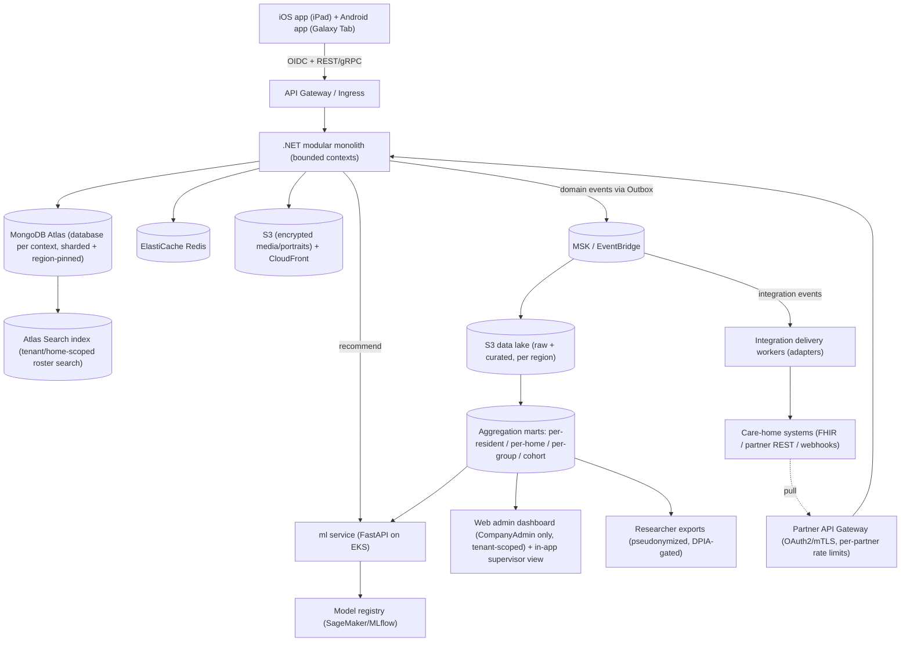

# NoteStalgia — Production Implementation Plan

> Execution target: a later date, by another engineer/agent.
>
> **POC pickup (Claude / Cursor):** start with repo-root [`AGENTS.md`](../AGENTS.md) and
> [`docs/HANDOFF_PLAN.md`](HANDOFF_PLAN.md). Living product decisions for the current POC are
> catalogued in [`README.md`](../README.md). This document is the **production** architecture plan.
>
> Code references below are paths within the `NoteStalgia-iOS` repository root (this file lives in `docs/`).

## 1. Context (what exists today)

Two native POCs exist — iOS (feature-complete care path) and Android (core-path parity). Everything is still in-memory / on-device. Production must carry forward the product surfaces below, not just the older tenancy/roster slice.

**iOS (`NoteStalgia-iOS`) — product surfaces to preserve**

- **Auth:** work email + **6-digit PIN** (`SixDigitPinInput` / `SupervisorAuth.pinDigitCount = 6`); multi-home picker; **self-service PIN reset** (`SupervisorPinResetStep`: email → demo verification → new PIN → confirm) via `SupervisorCredentialStore` (UserDefaults overrides — replace in prod). Demo: `max@…` supervisor, `alex@…` multi-home lead, PIN `123456`.
- **Tenancy:** `CareOrganisation` → `CareHome` (+ wings) → `SupervisorAccount` with roles `supervisor` / `homeLead` / `orgAdmin` (`isHomeAdmin`). Residents: `homeId`, `wingId`, `roomLabel`, `isActive`, **`nationality`**.
- **Curated roster:** `CareRosterEngine` — pinned / recent / due / wing / search (name, room, wing) / browse-all; UI prefs in `CareRosterUIStore`.
- **Home Admin insights dashboard (new):** `CareHomeAdminScreens` + `CareHomeAnalytics` — 14-day KPIs (sessions, residents reached, avg calm, observed wellbeing), calm/wellbeing trends, wing breakdown, positive highlights, needs-attention list, recent sessions. Role-gated via `isHomeAdmin`.
- **Discovery + nationality soft-bias:** age + nationality drafts (`NewResidentDiscoveryStore`); `ResidentNationality` / `ResidentNationalityMusicBias` bias snippet order and genre candidates in `DiscoveryPlaylistTuning`.
- **Resident calm surface:** instrument glyphs, nebula orb, **mood-matched visuals** (`MusicVisualMood`), **in-session playlist comfort feedback** (`ResidentPlaylistComfortChoice` — feels good / try something else / implicit neutral), surface telemetry (`ResidentSurfaceStore` / `ResidentSurfaceSessionMetrics`).
- **Post-session:** sequential 1–10 sentiment + auto-generated **session insight** pack (`SessionSentimentStore`, `careSessionInsight` phase); richer `CareSessionRecord` (ratings, surface metrics, insight narrative / handover / family texts).
- **Group sessions:** supervisor-led compiled playlist + group feedback (morale / alertness / lucidity / engagement) — `GroupSessionStore`.
- **Architecture in the POC:** `SessionPOCState` is now a **coordinator** over domain stores (`SupervisorAuthStore`, `CareDataStore`, `CareRosterUIStore`, `ResidentSurfaceStore`, `GroupSessionStore`, `ImmersiveSessionVitalsStore`, …) with selective `objectWillChange` forwarding (auth/vitals isolated for performance). This is the seed for production SPM / feature modules.
- **Still present but drop for v1:** Face ID linking (`PatientFaceID*`); IoT toggles in `ImmersiveSessionVitalsStore` (Hue/HomeKit/Matter) — **out of scope**.

**Android (`../NoteStalgia-Android`) — already started**

- Kotlin + Jetpack Compose POC with email + 6-digit PIN, home picker, curated roster, resident calm (real Media3/ExoPlayer), discovery UI, session feedback/insight, and **admin dashboard** on mock data. Single `SessionViewModel` coordinator. Gaps: no persistence, discovery does not create residents, group sessions deferred, FFT orb stubbed. Production builds on this repo rather than greenfield UI.

**Alignment note:** POC `orgAdmin` / `homeLead` / `supervisor` map to plan `CompanyAdmin` / `HomeAdmin` / `Supervisor`. Production formalises time-bounded home assignments (Section 5), server-side roster search (Section 5.1), hashed 6-digit PIN + real reset (Section 6), and promotes `CareHomeAnalytics` KPIs into the Insights context + web dashboard (Section 8).

**Data sensitivity:** resident PII (incl. **nationality**) + special-category (health/wellbeing) data. GDPR Art. 9 applies. No biometric auth data — authentication is 6-digit PIN-based.

## 2. Architecture decisions (confirmed)

- **Cloud:** AWS, primary region `eu-west-2` (London) for UK residency; `eu-central-1`/`eu-west-1` for EU; expansion regions added per market.
- **Data store:** **MongoDB (document/NoSQL)** via **MongoDB Atlas** — Global Clusters for zone-based data residency, native sharding for horizontal scale, and Queryable Encryption/CSFLE for PII (Amazon DocumentDB is the fallback if a single-vendor AWS-native stack is later required).
- **Compute:** Kubernetes (EKS) for backend + ML, multi-region, GitOps-managed.
- **ML:** phased recommender (heuristic -> classical ML -> deep learning) behind one stable serving interface.
- **Auth:** in-house, OWASP ASVS-aligned, OIDC-shaped for Auth0/Cognito later. **Email + 6-digit PIN** baseline (matching current POCs), with self-service PIN reset and a **pluggable factor pipeline so MFA can be enabled later without rework** (Section 6).
- **Backend style:** modular monolith with strict DDD bounded contexts (Clean Architecture per context) — split into services only when a context demands it (YAGNI). One deployable now, clean seams to peel off later.
- **Clients:** **native iOS (SwiftUI, iPad)** and **native Android (Kotlin + Jetpack Compose, Samsung Galaxy Tab)** — both POCs already exist under `NoteStalgia-iOS` / `NoteStalgia-Android`. Kept in **parity through shared OpenAPI/event contracts**; production evolves the POC UIs rather than rewriting from scratch (Section 11).
- **Cost & provisioning:** default to the **most cost-efficient elastic AWS services** (Graviton/ARM, Spot via Karpenter, serverless for spiky paths, Athena, S3 tiering — pay-for-use, scale to zero where possible), and make the whole stack **bring-your-own-account + one-command idempotent** via Terraform/Terragrunt + GitOps (Sections 12.1–12.3).
- **Target scale:** designed to serve the **entire UK market — up to ~17,000 care homes** (and beyond, internationally) without re-architecture. Capacity envelope, SLOs, and resilience patterns are in Section 13.

## 3. Repositories to create

Start from the existing POC repos (already created on disk as `NoteStalgia-iOS` / `NoteStalgia-Android`); scaffold the remaining services.

- `notestalgia-ios` — evolve `NoteStalgia-iOS` (SwiftUI iPad POC → production SPM modules).
- `notestalgia-android` — evolve `NoteStalgia-Android` (Compose Galaxy Tab POC → production feature modules).
- `notestalgia-backend` — .NET (latest LTS) modular monolith, DDD bounded contexts.
- `notestalgia-web` — web admin dashboard for care-home-company supervisors/admins (insights, rosters, exports); access locked to company-admin roles, scoped to the company's own tenant data (see Sections 6 and 8).
- `notestalgia-infra` — Terraform IaC (AWS, EKS, multi-region, networking, data stores).
- `notestalgia-ml` — Python (FastAPI) model-serving + training pipelines + MLOps.
- `notestalgia-contracts` — single source of truth for API (OpenAPI) + domain events (JSON Schema/Avro); generates iOS (Swift) + Android (Kotlin) + web + backend + ml clients.

Each repo gets: `README.md` (engineer onboarding + decisions), `AGENTS.md` + `.cursor/skills/` (agent conventions), `docs/decisions/` ADRs (MADR format), CODEOWNERS, conventional-commit + lint pre-commit hooks, and CI gates.

## 4. Backend domain boundaries (.NET)

Bounded contexts (each = folder/module with `Api`, `Application` (CQRS via MediatR + FluentValidation), `Domain`, `Infrastructure` (MongoDB .NET driver + repository per aggregate)):

- **Identity & Access** — supervisors/staff, orgs, sessions, tokens, RBAC, **staff onboarding**, and **6-digit PIN enrolment + self-service/admin PIN reset**. PIN-based auth only (no biometrics).
- **Care Organisation** — care groups/companies, homes, regions, device/MDM registration, tenancy. Models **time-bounded home assignments** for both residents and staff (not a hard single-home foreign key): a resident or supervisor belongs to the **company** (the tenant), and has a current + historical set of **home memberships** with effective dates and a `temporary` flag, so transfers and short-term cover are first-class (see Section 5).
- **Resident Profile** — person-centred profiles, sensory prefs, portraits, **nationality** (PII; soft recommender bias only — replaces `CarePatientProfile`; no Face ID linking). The profile follows the resident across homes within the same company; the home a session happened in is recorded on the session, not the profile.
- **Sessions** — one-to-one, discovery calibration (age + nationality), **group sessions**, live telemetry including **playlist comfort choices** and mood-matched media events (replaces flow logic in `SessionPOCState` / domain stores).
- **Wellbeing & Outcomes** — sequential 1–10 ratings, **session insight packs** (narrative / handover / family texts), longitudinal analytics, researcher export (DPIA-gated).
- **Media & Streaming** — catalog abstraction, era/mood-matched search (`MusicVisualMood` as the UX seed), signed playback tokens (vague licensed-provider impl, real hooks).
- **Recommendations** — gateway to the ML service; ports `DiscoveryPlaylistTuning` + `ResidentNationalityMusicBias` as the v0 heuristic model.
- **Insights & Aggregation** — read-side context that turns raw session/playlist/wellbeing events into governed aggregates. Canonical KPI definitions start from the POC's `CareHomeAnalytics` (14-day sessions, reach, avg calm, observed wellbeing, wing breakdown, highlights, attention list) so in-app Home Admin and the web dashboard never diverge (see Section 8).
- **Integration & Interoperability** — partner-facing data-sharing API + adapters that push session outcomes/wellbeing into existing care-home systems (see Section 9). Anti-corruption layer + per-partner adapters keep the core clean.
- **Consent & Privacy** — consent records, lawful basis (incl. per-partner sharing consent), DSAR automation, retention/erasure, audit log.
- **Notifications** — staff/admin notifications and event fan-out via **APNs (iOS) + FCM (Android)**. (IoT/room orchestration is **out of scope**.)

Cross-cutting: Result/Problem-Details error model, MediatR pipeline behaviors (validation, logging, auth), transactional **Outbox** for domain events, OpenTelemetry everywhere.

**Extensibility & maintainability principles (make it hard to break, easy to extend).** Each context uses **ports & adapters (hexagonal)** so external providers, integrations, and infra are swappable behind interfaces; API + event **contracts are versioned and evolved backward-compatibly** (additive changes, no breaking a live consumer); new capabilities are added as **new contexts / adapters / event consumers** rather than edits to existing ones (open-closed). Feature flags gate rollout. The result: adding a feature (or a new integration partner, Section 9) is additive and isolated, keeping the system robust and low-duplication.

## 5. Data & persistence patterns

- **Operational store:** **MongoDB Atlas (document/NoSQL)**, **database-per-bounded-context** with collections per aggregate. Model around access patterns: embed tightly-coupled child data in the aggregate document, reference across contexts by id (no cross-context joins — contexts own their data). Enforce structure with **JSON Schema validators** + a `schemaVersion` field per document; "migrations" are versioned, idempotent transform scripts checked into the repo (lazy/on-write upgrades where possible).
- **PII strategy:** explicit PII/special-category field tagging; **MongoDB Queryable Encryption / CSFLE** with **per-subject data encryption keys** in a KMS-backed key vault (AWS KMS as the CMK) to enable crypto-shredding (erasure = destroy the subject key). Append-only audit collection.
- **Cache/session:** ElastiCache Redis.
- **Blobs:** S3 (SSE-KMS) for portraits/media + CloudFront, signed URLs only.
- **Analytics/research:** domain events -> S3 data lake -> curated aggregation marts (full pipeline in Section 8). OLTP and analytics are deliberately separated so heavy reporting never touches the resident-facing transactional path.
- **Multi-tenancy & scale:** tenant = **care-home company** (residents and staff belong to the company, homes are sub-units within it); every document carries a `tenantId` (+ `homeId` where relevant) with tenant isolation enforced at the repository layer. **Shard on a `tenantId`-based key** and use **Atlas Global Clusters with zone sharding** to pin each tenant's data to its required region (UK/EU residency) — this is also the horizontal-scale mechanism for the "thousands of homes" target.
- **Home mobility (residents + staff):** model membership as an append-only **assignments collection** (`subjectId`, `homeId`, `effectiveFrom`, `effectiveTo` nullable, `isTemporary`) rather than a single `homeId` field. Current home = the open-ended document; transfers and temporary cover just open/close documents, preserving full history. A supervisor's effective home scope (Section 6) is derived from their active assignments, so temporary moves automatically grant/revoke the right access without manual cleanup.
- **Interoperability data (supports Section 9):** planned from the start so data sharing is not a retrofit — an `externalReferences` collection maps a resident/session to partner-system identifiers (`partnerId`, `externalResidentId`, `system`); a `sharingConsents` collection records per-resident/per-partner share consent + lawful basis; a `deliveryLog` collection records every outbound share (payload hash, partner, status, receipt). Canonical outcome documents carry stable immutable ids + an `updatedAt` cursor so partners can incrementally sync.

### 5.1 Roster patient search (data + infrastructure)

The POC does this **client-side** (`CareRosterEngine.matchesSearch` substring-scans an in-memory list). That works for ~34 mock residents but is wrong at production scale and for PII governance: a device must never hold a whole home's/company's roster to search it, and PII search is itself an access event that must be authorised and audited. Production makes search a **governed, server-side capability**.

- **Search backend — MongoDB Atlas Search (native).** Use Atlas Search (Lucene indexes built into the same cluster) rather than standing up a separate OpenSearch/Elasticsearch system (YAGNI — no extra infra, no second copy of PII, no separate DR story). It gives **prefix/autocomplete, fuzzy/typo tolerance, diacritic folding, and relevance ranking** over the residents collection. OpenSearch remains the documented escalation path only if cross-org platform-admin or advanced relevance later demands it.
- **What's searchable vs. encrypted (the key PII decision).** Split resident fields:
  - **Searchable identifiers** — `displayName`, `roomLabel`, `wingId`/wing name, care-context label. These are minimally-sensitive *operational* fields; keep them queryable (protected by at-rest encryption + strict tenant/RBAC scoping + audit), because CSFLE/Queryable Encryption does **not** support substring/prefix search.
  - **Special-category fields** — care notes, wellbeing ratings, health themes — stay **CSFLE-encrypted and are never indexed or searchable**. Search returns *identity + location* only; opening a profile is a separate, separately-authorised read.
  - If policy later requires names to be encrypted too, the fallback is a **blind index** (HMAC token index with per-tenant keys) supporting equality/prefix lookups without exposing plaintext — noted as an option, not built by default (KISS).
- **Hard tenant + home scoping.** Every query is constrained server-side to the caller's `tenantId` and their **assignment-derived home scope** (Section 5/6): a `Supervisor` searches their current home; a `HomeAdmin`/`homeLead` searches their assigned homes; `CompanyAdmin`/`orgAdmin` searches the whole company. Scope is applied as a mandatory Atlas Search `filter` (compound query), never trusting a client-supplied scope. Only `isActive` residents by default.
- **Search reflects mobility & erasure.** Because "current home" is derived from the open-ended assignment document, a transferred resident appears under their new home automatically. Crypto-shredded/erased residents (Section 7) are removed from the index via the same event pipeline (tombstone on erasure), so they can never surface in results.
- **Index freshness via the event pipeline.** The Atlas Search index updates from resident create/update/transfer/erase events (Outbox -> change stream), so search stays consistent with the operational store without bespoke sync code.
- **API shape & performance.** A single `GET /homes/{homeId}/residents/search?q=&scope=&page=` (and a company-scoped variant) returning paged, ranked, projection-limited results (id, name, room, wing, thumbnail ref, last-session/due flag). Server-side pagination + result caps (mirroring the POC's `searchResultsLimit`), Redis-cached hot/empty queries, and **debounced (~250 ms) prefix queries** from the iPad/web client. The roster's **pinned / recent / due / wing** sections stay as separate, cheap read-model queries (CQRS) — search is only invoked when the user types.
- **Auditing.** Every resident search (query text hash, scope, result count, actor) is written to the append-only audit log — searching PII is a DSAR-relevant access event.
- **Client behaviour.** iOS/web keep only the *current view* of results (never a full roster), call the search API with async/await + cancellation of superseded queries, and degrade gracefully offline to the locally-cached recent/pinned residents only.

## 6. Security (OWASP) & auth abstraction

- **Authentication is 6-digit PIN-based — no biometrics/Face ID.** Custom auth service issuing **OIDC-compliant** JWT access + refresh tokens; staff sign in with **email + 6-digit PIN** (matching current POCs: `PinInputSpec.digitCount = 6`, segmented OTP-style UI). PIN is **Argon2id-hashed**, never stored in plaintext; lockout/throttling and rotation policies apply. An optional account password is used only for web-dashboard recovery/admin. The POC's Face ID resident linking and `SupervisorCredentialStore` UserDefaults overrides are dropped — residents start sessions via supervisor handoff.
- Behind `IIdentityProvider` / standard OIDC discovery so swapping to Auth0/Cognito later is config, not code.
- **MFA-ready (planned, not enabled day one).** The auth layer is designed so multi-factor auth can be turned on later **without rework**: model authentication as a **pluggable step/factor pipeline** (primary factor = PIN/password today; add a second factor behind an `IAuthFactor` interface) and represent assurance as an **AAL/`amr` claim** on the issued token so downstream policies can require step-up per action (e.g. admin/data-export operations). Anticipated factors: TOTP authenticator apps and email/SMS OTP for the web dashboard; on-device attestation for the iPad. **Per-tenant MFA policy** (a care company can mandate MFA for `CompanyAdmin`/`HomeAdmin`) with enrolment, recovery/backup codes, and remembered-device options. Because auth sits behind `IIdentityProvider`, MFA can alternatively be delegated wholesale to Auth0/Cognito when migrated — so we build the seams now and defer the full implementation (YAGNI).
- **Role model (RBAC + tenancy):** roles are scoped to a tenant (care-home company). Core roles: `Supervisor` (floor staff, iPad sessions), `HomeAdmin` (one home), `CompanyAdmin` (whole care-home company — the web dashboard audience), and internal `PlatformOperator`/`Researcher`. The **web dashboard is locked to `CompanyAdmin` (and optionally `HomeAdmin`) roles only**, and every query is hard-scoped to the caller's own company tenant — one company can never see another's residents or aggregates. Enforced centrally (policy/claims in the auth layer + row-level tenant filters), not per-screen.
- **Home scope follows assignments:** a `Supervisor`/`HomeAdmin`'s accessible homes are derived from their **active home assignments** (Section 5), not a static field. A temporary transfer grants access to the new home for the assignment window and revokes it automatically when the window closes — no orphaned permissions. `CompanyAdmin` always spans the whole company.
- OWASP ASVS controls: rate limiting, lockout, RBAC + least privilege, input validation (FluentValidation), output encoding, security headers, dependency scanning (CI), secrets in AWS Secrets Manager, AWS WAF + Shield, mTLS between services.
- Automated security gates in CI: SAST, dependency audit, container scan, IaC scan.

**Staff onboarding flow (web dashboard):** a `CompanyAdmin` (or `HomeAdmin`, within their homes) invites a new staff member from `notestalgia-web` -> the system issues a single-use, expiring invite (email/SMS) -> the invitee activates their account and sets their PIN (plus an optional recovery password for the web dashboard) -> they are assigned a role and one or more (optionally temporary) home assignments -> they acknowledge required training/data-handling terms (captured for compliance) -> account becomes active and immediately scoped per Section 5/6. Invites, activations, role/assignment changes, and revocations are all written to the immutable audit log. Off-boarding/suspension is the same flow in reverse (closes assignments, revokes tokens).

**Credential reset & recovery flow (OWASP-aligned) — productionises the POC's `SupervisorPinResetStep`.**

- **Staff 6-digit PIN reset:** self-service via work email (POC already has the multi-step UX: email → verification → new PIN → confirm). Production replaces the demo code (`000000`) / UserDefaults overrides with a **single-use, short-expiry, rate-limited emailed OTP/token**; responses are constant-time with **no account enumeration**. On success the staff member re-enrols a new 6-digit PIN and **all existing refresh tokens are revoked**. A `HomeAdmin`/`CompanyAdmin` can also issue an **admin-initiated reset** from the web or in-app admin surface, forcing PIN re-enrolment at next sign-in. Repeated PIN failures trigger lockout + admin-assisted reset.
- **Web-dashboard password reset:** standard forgot-password flow — emailed single-use expiring token (**stored only as a hash**), constant-time / non-enumerating responses, rate limiting/throttling, password-strength policy, and **full session + token invalidation** on completion.
- Both flows are **fully audit-logged** (request, issue, completion, actor, IP), tenant-scoped, and delivered over HTTPS-only single-use links. Behind `IIdentityProvider`, so reset can later be delegated to Auth0/Cognito with no domain change.

## 7. GDPR & data-retention automation (first-class)

- **Consent & Privacy** context owns: consent + lawful-basis records, **automated DSAR** (access, portability, erasure) endpoints, **retention policies as code** with scheduled TTL/anonymization jobs, crypto-shredding on erasure, immutable audit trail.
- DPIA + Record of Processing maintained in `docs/compliance/`.
- Data residency enforced at the routing + storage layer (region pinning by tenant).

## 8. Insights & data aggregation (researchers + care homes)

This is a first-class capability, not a reporting afterthought — it is what makes the platform valuable to care homes (operational dashboards, CQC/family evidence) and researchers (cohort outcomes, the pitch deck's evaluation study). It feeds the recommender too, so the same pipeline serves three consumers.

**Event-first capture (the foundation).** Every meaningful action emits a typed, versioned domain event via the transactional **Outbox** — discovery snippet sentiment, track/genre played, track changes, immersive entries, **playlist comfort choices** (`feelsGood` / `trySomethingElse` / implicit neutral), session start/stop + duration, wellbeing ratings (mood/alertness/emotional/lucidity), session insight pack saved, group morale/engagement. These mirror today's `ResidentSurfaceSessionMetrics`, comfort feedback, and `CareSessionRecord` fields but become durable, append-only facts. Event schemas live in `notestalgia-contracts` so producers and the aggregation layer never drift.

**Pipeline (medallion / lakehouse pattern).**

- **Raw (bronze):** events land in the region-pinned S3 data lake exactly as emitted.
- **Curated (silver):** cleaned, conformed, pseudonymized fact tables (one resident pseudonym per subject key) partitioned by tenant + time.
- **Aggregation marts (gold):** pre-computed rollups at the grains that matter — **per-resident**, **per-home**, **per-care-company**, and **anonymized cross-home cohort**. Built incrementally (dbt-style transforms on Athena/Redshift) so aggregates stay cheap and fresh.

**Mobility-correct attribution.** Because residents and staff move homes (Section 5), every event records the **home it occurred in at the time** (not the subject's current home). Per-home rollups therefore stay historically accurate after a transfer, while per-resident rollups follow the resident across homes within the company — giving care homes a true picture of activity in *their* building and researchers an unbroken longitudinal record per resident.

**Standardised metrics (defined once).** The Insights & Aggregation context owns a single semantic definition of each metric, **seeded from the POC's `CareHomeAnalytics`** so production never invents a second meaning:

- **Home Admin KPIs (POC baseline):** 14-day session count, residents reached, avg calm %, observed wellbeing composite, calm/wellbeing trend series, wing impact breakdown, positive highlights, needs-attention (overdue ≥7 days or declining trend), recent sessions.
- **Extended metrics:** playlist/genre engagement (genre uptake, comfort-choice rates, skip/change rate, favourite drift, discovery-to-retention), wellbeing trajectories, and correlation views (e.g. *genre engagement vs. wellbeing trend over time*).

One definition prevents the "every dashboard computes engagement differently" problem across iOS Home Admin, Android admin, and the web dashboard.

**Two governed consumers, two access paths.**

- **Care homes:** low-latency aggregates served back through the backend API into the **in-app Home Admin dashboard** (already prototyped on iOS + Android for `homeLead`/`orgAdmin`) and the richer **`notestalgia-web` admin dashboard**. Web is trends + drill-down by home/resident + CSV/PDF export; both are **restricted to `CompanyAdmin` / `HomeAdmin` roles, hard-scoped to that company's own tenant** (Section 6).
- **Researchers:** pseudonymized, **DPIA- and consent-gated**, k-anonymity-thresholded cohort exports (suppress small cells) with full audit logging of every export. Aggregation respects erasure — crypto-shredded subjects drop out of future rollups.

**Why this design:** OLTP stays lean; aggregation is reproducible, versioned, and re-runnable from raw events; new questions become new gold transforms (no schema migrations on the live path); and the exact same curated layer powers recommender features (Section 10), avoiding duplication.

## 9. Data sharing & interoperability API (care-home systems)

The pitch deck's value depends on the data NoteStalgia captures feeding back into care — it explicitly targets "person-centred care plans and CQC evidence", longitudinal wellbeing records, and "researcher-grade data export". Care homes already run electronic care-planning / care-management systems (e.g. Person Centred Software, Nourish, Log my Care, Care Control). NoteStalgia must **push its session outcomes and wellbeing signals into those systems** rather than be another silo. This is a first-class, versioned, partner-facing capability — and the data model (Section 5) is planned for it.

**Bounded context — Integration & Interoperability.** A dedicated context owns partner registration, credentials, data-mapping, delivery, and receipts, behind an **anti-corruption layer**: each external system gets its own **adapter** (ports & adapters). Partner quirks never leak into the core domain, so adding a new care system = adding an adapter, with **no core changes** (open-closed, easily extendible).

**Canonical model + adapters.** Internally we publish a stable **canonical outcome schema** (session summary, wellbeing ratings, engagement/usage, genre uptake) in `notestalgia-contracts`. Adapters map canonical -> target:

- **FHIR R4** (`Observation`, `QuestionnaireResponse`, `CarePlan`/`Encounter` references) as the interoperability default for systems that speak it.
- **Partner-native REST** adapters for the major UK care systems.
- **Generic outbound webhooks + bulk file export** (JSON/CSV, optional SFTP/S3 drop) for everything else.

**Access patterns (push and pull).**

- **Push (near-real-time):** on session-finalised / feedback-saved integration events (Outbox -> EventBridge/SQS), a delivery worker transforms + delivers to subscribed partners with **at-least-once delivery, idempotency keys, retries with backoff, and a dead-letter queue**; delivery receipts + status recorded in `deliveryLog`.
- **Pull (partner API):** versioned REST (`/v1/...`) behind a **separate partner API gateway**, OAuth2 client-credentials per partner (scoped, per-tenant), pagination, and incremental sync via `updatedSince` cursors.

**Governance (non-negotiable for PII/health).** Sharing is **consent- and DPIA-gated per resident and per tenant** (explicit "share with system X" consent captured in Consent & Privacy, Section 7); data residency respected; **minimum-necessary** fields only; **every outbound share is audit-logged** (what, to whom, when, lawful basis) and included in DSAR/erasure. A resident's erasure stops future shares and issues a withdraw/delete signal to partners where supported.

**Infrastructure.** A dedicated **partner-facing API Gateway** (separate hostname, WAF, per-partner rate limits, mTLS/OAuth2) isolated from the resident/staff app API; **delivery workers on EKS** (or Lambda for spiky low volume) consuming SQS with DLQ + replay; S3 (SSE-KMS) + presigned/SFTP for bulk drops; per-partner secrets in AWS Secrets Manager; per-partner observability (delivery-success SLOs, dashboards, alerting). Partner onboarding is config + an adapter, not a redeploy of the core.

## 10. Recommender / "neural network" (phased, industry MLOps)

- `notestalgia-ml` (FastAPI) exposes a **stable scoring contract**; backend calls it via `IRecommendationService`.
- **Phase A:** port `DiscoveryPlaylistTuning` + `ResidentNationalityMusicBias` heuristics behind the contract (ship value immediately — era/peak-years + nationality soft-bias + discovery traffic-lights + comfort choices).
- **Phase B:** classical ML (gradient-boosted ranking) on discovery feedback, comfort choices, and session telemetry.
- **Phase C:** deep-learning sequence/embedding recommender (era + nationality affinity + sentiment + engagement).
- **MLOps:** features are sourced from the **curated/gold aggregation layer (Section 8)** — no separate ingestion — then a **feature store**, **model registry** (SageMaker or MLflow), offline eval + champion/challenger A/B, drift + performance monitoring, reproducible training in CI. Models are versioned and swappable with zero backend change.

## 11. Mobile clients (iOS + Android)

Both POCs already exist. Production **evolves them** against the same backend contracts (offline-first, accessibility-first, generated clients). A shared behaviour/feature checklist + contract tests keep parity; only platform SDKs differ.

**Product surfaces both clients must ship (from current POCs)**

- Email + **6-digit PIN** sign-in, multi-home picker, PIN reset UX, curated roster (search / pin / recent / due / wing), resident profile, discovery (age + nationality), resident calm (glyphs, orb, mood-matched visuals, comfort feedback), post-session sentiment + insight pack, **Home Admin insights dashboard**, group sessions (iOS first; Android closes the gap).

**iOS (iPad — evolve `NoteStalgia-iOS`)**

- Promote the POC's **coordinator + domain stores** pattern into **SPM feature modules** mirroring backend contexts; MVVM + Observation; `async/await` + actors. Keep selective change-forwarding (don't invalidate the orb on every PIN keystroke / HR tick).
- **Offline-first:** SwiftData/Core Data + repository + background sync/outbox (ships usage/playlist/comfort telemetry even offline).
- **Networking:** generated OpenAPI client; structured concurrency; typed errors; retry/backoff.
- **Audio/visual streaming:** `MediaStreamingProvider` over `AVPlayer`, evolving `StreamAudioCache` + `MusicVisualMood` scene/clip mapping; licensed provider remains a hook.
- Accessibility-first (VoiceOver, Reduce-Motion) as a module-level contract + tests. Drop Face ID + IoT from the production tree.

**Android (Samsung Galaxy Tab — evolve `NoteStalgia-Android`)**

- Promote the POC's Compose UI + `SessionViewModel` into **feature Gradle modules** mirroring the iOS module map; **MVVM/MVI + Coroutines/Flow**; repositories replace the in-memory mock.
- **Offline-first:** **Room** + **WorkManager** sync/outbox. Persist discovery outcomes (POC currently does not create residents on save).
- **Networking:** generated **Kotlin OpenAPI client** (Retrofit/Ktor).
- **Audio/visual streaming:** `MediaStreamingProvider` over **Media3/ExoPlayer** (already real in the POC); add FFT-reactive orb later; reuse mood/scene mapping parity with iOS.
- **Accessibility-first:** TalkBack, reduce-motion, large-text. **6-digit PIN + MFA-ready** identical to iOS.
- **Galaxy Tab specifics:** large-screen adaptive layouts (window size classes); tablet-first forms; Android Enterprise / Samsung Knox MDM.
- **Close parity gaps:** group sessions, real insight metrics (POC hardcodes some), persistence, FFT orb.

**Cross-platform parity & device management**

- Parity enforced at the contract layer + shared behaviour checklist in both CIs.
- Managed devices: iOS via MDM/Apple Business Manager; Android via **Android Enterprise / Samsung Knox**.

## 12. Infrastructure, deployment & observability

- **IaC:** Terraform in `notestalgia-infra` — VPCs, EKS clusters per region, **MongoDB Atlas (Terraform Atlas provider: Global Clusters, zone sharding, PrivateLink peering)**, ElastiCache, S3/CloudFront, MSK/EventBridge, KMS, WAF, Secrets Manager.
- **Deploy:** GitHub Actions CI -> container images -> **GitOps (ArgoCD)** to EKS; trunk-based; dev/staging/prod; blue-green/canary.
- **Scale:** HPA/Karpenter, multi-region active-active for stateless tier, Atlas sharded Global Clusters for data; cell-based tenancy seam.
- **Observability (engineer + monitoring agent friendly):** OpenTelemetry traces, structured JSON logs (Serilog) with correlation IDs, Prometheus/Grafana + CloudWatch, health/readiness probes, runbooks in `docs/runbooks/`.

### 12.1 Cost-efficient, scalable AWS technology choices

Every tier defaults to the cheapest option that still scales elastically — pay for what's used, scale to zero where possible:

- **Compute:** EKS on **Graviton (ARM64)** nodes provisioned by **Karpenter**, with **Spot** for stateless/batch work (recommender training, integration delivery workers, analytics jobs) and a small on-demand/Savings-Plan baseline for latency-critical pods; Karpenter consolidation bin-packs and scales nodes down aggressively. Non-prod clusters **scale to zero** off-hours.
- **Serverless-first for spiky/low-volume paths:** **Lambda (Graviton)** for integration delivery workers, scheduled retention/anonymization jobs, and webhooks; **SQS + EventBridge** (pay-per-use) for eventing rather than always-on brokers — MSK / **MSK Serverless** only once sustained high-throughput streaming justifies it.
- **Analytics:** **Athena** (serverless, pay-per-query) over the S3 lake as the default; **Redshift Serverless** only if interactive BI demands it. S3 with **Intelligent-Tiering + lifecycle** to Glacier for raw/aged data.
- **Data store:** **MongoDB Atlas auto-scaling** — **Atlas Serverless** for dev and small/new tenants, dedicated auto-scaling clusters (committed-use discount) for large prod tenants; add shards with demand.
- **Edge/media:** **CloudFront + on-device caching** offloads egress from the app tier; compression + cache TTLs cut transfer cost.
- **Commitments:** **Compute Savings Plans** + Graviton + Spot are the primary cost levers; reserved capacity only for proven steady baselines.

### 12.2 FinOps & cost governance

- **Cost-allocation tags** on every resource (env, service, region, and **tenant/cell** where feasible) so per-tenant/per-home unit economics are visible.
- **AWS Budgets + Cost Anomaly Detection** with alerts, Cost Explorer dashboards, and right-sizing reviews wired into the observability cadence.

### 12.3 One-command, idempotent provisioning (bring-your-own AWS account)

Goal: **provide AWS account credentials, run one command, get the whole stack** — and re-running changes nothing that doesn't need changing (idempotent).

- **Terraform is the idempotent engine** (declarative desired-state; repeated `apply` is a no-op when nothing changed), organised with **Terragrunt** for DRY env/region composition. Kubernetes workloads are declarative via **Helm + ArgoCD (GitOps)**, so cluster state is reconciled continuously and idempotently.
- **Self-bootstrapping remote state:** a `bootstrap` script idempotently creates the **Terraform state S3 bucket + DynamoDB lock table** (skips if already present), then hands off to Terraform — no manual console clicks.
- **Credentials in, stack up:** supply an AWS profile / access keys (or, preferably, assume a **least-privilege bootstrap IAM role** via OIDC) plus **MongoDB Atlas API keys**; everything else (VPC, EKS, Atlas, data stores, gateways, secrets scaffolding) is provisioned by code. Simple entrypoints per `env`/`region`: `make bootstrap`, `make plan`, `make up`, `make down`.
- **Reproducible & tear-down-safe:** pinned provider/module versions, per-environment variable files, and a matching destroy path so ephemeral environments (PR previews, load-test cells) spin up and down cleanly. Secrets are seeded into AWS Secrets Manager by the pipeline, never committed.

## 13. Resilience & scale to 17,000 UK care homes

This is an explicit, testable target. The numbers below show the load is modest for a horizontally-scaled, event-driven design — the work is in *proving* it and engineering for failure, not in exotic capacity.

**Load model (conservative back-of-envelope).**

- ~17,000 homes x ~50 residents ~= **850k resident profiles**; with staff, low single-digit millions of accounts.
- Sessions are short and human-paced. Even if every home runs sessions through the day, realistic **peak concurrency is ~20k-60k active sessions**; telemetry is a handful of small events per session. That is **low-thousands of writes/sec at peak** and mostly cacheable reads — comfortably within a sharded Atlas + autoscaled stateless tier.
- Heavy media bytes are served by **CloudFront/CDN + on-device caching**, not the app tier, so audio streaming scale is decoupled from the API.

**Scalability mechanisms (already in the plan, made explicit here).**

- **Stateless API/ML pods on EKS** behind HPA + Karpenter — scale horizontally on CPU/RPS/queue-depth; no sticky state.
- **MongoDB Atlas sharding on a `tenantId`-derived key** distributes 17k tenants across shards; add shards to add capacity (near-linear). Hot tenants isolated; reads served from secondaries where safe.
- **Partitioned event streaming** (MSK/EventBridge) keyed by tenant for parallel, ordered-per-tenant processing; the analytics/aggregation path (Section 8) is fully decoupled so reporting load never touches the resident-facing path.
- **Read models / CQRS + Redis caching** keep dashboard and roster reads cheap at fan-out.
- **Cell-based architecture seam:** tenants are grouped into independently-scalable cells, capping the blast radius of any single failure and giving a clean path to many millions of users.

**Resilience patterns (engineered for failure).**

- **Multi-AZ everywhere** (EKS node groups + Atlas replica sets across >=3 AZs); **active-active multi-region** for the stateless tier, region-pinned data per residency.
- **Fault isolation in-process:** Polly-based **timeouts, retries with jitter, circuit breakers, and bulkheads** on every outbound dependency; **idempotency keys + the transactional Outbox** make retries safe and prevent double-writes.
- **Graceful degradation:** the iPad app is **offline-first** — a backend or network outage does not stop a resident's session; telemetry queues locally and syncs later. Non-critical features (recommender, dashboards) fail soft without breaking core playback.
- **Load shedding & abuse protection:** per-tenant rate limiting, request quotas, and queue-based backpressure so one busy company can't degrade others ("noisy neighbour" protection).
- **Backups & DR:** Atlas continuous backups + point-in-time restore; documented **RTO/RPO targets** (e.g. RPO <= 5 min, RTO <= 1 hr) validated by periodic restore drills; infra is reproducible from Terraform.
- **SLOs + error budgets:** define availability/latency SLOs (e.g. 99.9% API availability, p95 read < 300 ms), wired to the Section 12 observability stack with alerting and runbooks.

**Validation (don't just assert it — test it).**

- **Load/soak testing** to 2-3x the projected 17k-home peak in CI/staging (k6/Gatling) before each major release.
- **Chaos engineering** (pod/AZ/region kill, dependency latency injection) to verify the resilience patterns actually hold.
- Capacity headroom and autoscaling policies reviewed against real telemetry as homes onboard.

## 14. DevEx, linting/formatting, agent skills, docs

- **Backend:** `.editorconfig`, Roslyn analyzers + StyleCop, `dotnet format`; **iOS:** SwiftLint + SwiftFormat; **ml:** ruff + black + mypy. All enforced via pre-commit + CI.
- **Agent skills:** per-repo `.cursor/skills/` (e.g. `add-bounded-context`, `add-endpoint`, `add-ios-feature-module`, `add-migration`, `update-decision-log`) + `AGENTS.md` so agents and engineers follow identical patterns with no drift.
- **Docs:** large root `README.md` per repo (architecture, domains, local setup, conventions) + central **decision log** (`docs/decisions/NNNN-*.md`, MADR) updated on every major change.

## 15. Sequencing

Foundation (repos, tooling, contracts, docs, skills) -> backend domain skeleton + data layer -> identity/auth + credential reset -> consent/GDPR/retention -> sessions/wellbeing/export -> event capture + insights/aggregation pipeline + dashboards -> roster server-side search -> data-sharing/interoperability API + adapters -> media abstraction -> recommender (Phase A) + MLOps -> iOS re-architecture + Android (Galaxy Tab) app -> infra/EKS/multi-region -> observability + security + compliance hardening -> multi-tenancy/i18n/scale + resilience validation (load/chaos to 17k-home peak) -> recommender Phases B/C.

> Sequencing note: the **event-first capture** (Section 8) ships alongside the Sessions/Wellbeing contexts so real facts accumulate from day one; the aggregation marts, dashboards, and researcher exports build on top once enough data flows.

## 16. Implementation todos (checklist)

- [ ] **foundation** — Formalise the 7 repos from existing POCs (NoteStalgia-iOS + NoteStalgia-Android already present) plus backend, web, infra, ml, contracts. Add per-repo README, AGENTS.md, .cursor/skills/, docs/decisions (ADR/MADR) + first ADRs (AWS, EKS, MongoDB/NoSQL via Atlas, phased ML, custom-OIDC auth with 6-digit PIN, modular monolith, native iOS + Android clients, Home Admin analytics parity), CODEOWNERS, conventional-commit + lint pre-commit hooks, and baseline CI.
- [ ] **tooling-contracts** — Set up linting/formatting/test/CI gates per repo (EditorConfig + Roslyn/StyleCop + dotnet format; SwiftLint + SwiftFormat; Android ktlint/detekt; ruff/black/mypy). Stand up notestalgia-contracts (OpenAPI + versioned domain/telemetry event schemas for usage, playlist, and wellbeing facts) with client generation for iOS (Swift), Android (Kotlin), web, backend, and ml.
- [ ] **backend-skeleton** — Scaffold the .NET modular monolith with bounded contexts (Identity, Care Org, Resident Profile, Sessions, Wellbeing, Media, Recommendations, Insights & Aggregation, Consent & Privacy, Notifications), Clean Architecture per context, MongoDB .NET driver + repository per aggregate, MediatR + FluentValidation pipeline, Result/ProblemDetails, transactional Outbox, OpenTelemetry.
- [ ] **data-layer** — MongoDB Atlas database-per-context (collections per aggregate, JSON Schema validators + schemaVersion + versioned transform scripts), Queryable Encryption/CSFLE with per-subject keys in a KMS-backed key vault (crypto-shred ready), tenantId-based sharding + Global Cluster zone pinning for residency, Redis cache, S3+CloudFront for media/portraits, and the domain-event -> data-lake pipeline. Model home membership as an append-only, time-bounded assignments collection (subjectId, homeId, effectiveFrom/To, isTemporary) for both residents and staff; tenant = care-home company.
- [ ] **identity-auth** — In-house OIDC-shaped auth with email + 6-digit PIN sign-in only (Argon2id-hashed PINs, lockout/throttling/rotation, refresh tokens; no biometrics/Face ID) behind IIdentityProvider for future Auth0/Cognito swap. Design auth as a pluggable step/factor pipeline (IAuthFactor) with AAL/amr claims and per-tenant policy hooks so MFA can be enabled later without rework. Tenant-scoped RBAC (Supervisor/HomeAdmin/CompanyAdmin/PlatformOperator/Researcher) where home scope is derived from active assignments. OWASP ASVS controls + CI security gates.
- [ ] **staff-onboarding** — CompanyAdmin/HomeAdmin sends single-use expiring invites from the web dashboard; invitee activates account, sets their 6-digit PIN (plus optional recovery password), gets role + (optionally temporary) home assignments, and acknowledges training/data-handling terms. All invites/activations/role+assignment changes/revocations audit-logged; off-boarding closes assignments and revokes tokens.
- [ ] **credential-reset** — Productionise the POC SupervisorPinResetStep UX: self-service 6-digit PIN reset via emailed single-use short-expiry rate-limited OTP/token (constant-time, no account enumeration; replace demo code 000000 and UserDefaults overrides) with PIN re-enrolment + refresh-token revocation; admin-initiated PIN reset from web/in-app admin; web-dashboard password reset. All flows audit-logged and tenant-scoped, behind IIdentityProvider.
- [ ] **gdpr-consent** — Consent & Privacy context: consent/lawful-basis records (incl. per-partner sharing consent), automated DSAR (access/portability/erasure via crypto-shredding), retention-as-code with scheduled anonymization jobs, immutable audit log, and DPIA/RoPA docs under docs/compliance.
- [ ] **sessions-outcomes** — Port session flows from the POC: one-to-one, discovery (age + nationality), group sessions, playlist comfort feedback, mood-matched media events, sequential 1-10 sentiment + session insight packs. Record the home each session occurred in and emit every usage/playlist/comfort/wellbeing action as a typed, versioned Outbox event. Persist nationality as PII with consent; use only as soft recommender bias.
- [ ] **insights-aggregation** — Build Insights & Aggregation seeded from CareHomeAnalytics: medallion pipeline, canonical Home Admin KPIs (14-day sessions/reach/calm/wellbeing, wing breakdown, highlights, attention list) plus extended playlist/comfort metrics, low-latency aggregate APIs powering in-app Home Admin (iOS+Android) and notestalgia-web, and k-anonymity-thresholded, DPIA/consent-gated, fully-audited researcher exports that honour erasure.
- [ ] **roster-search** — Move roster patient search server-side (Section 5.1): MongoDB Atlas Search index over searchable identifiers (name/room/wing/context) with prefix/fuzzy/diacritic folding + relevance; keep special-category fields CSFLE-encrypted and non-indexed. Enforce hard tenant + assignment-derived home scoping as mandatory filters, reflect mobility (current-home) and erasure (tombstone) via the event pipeline, expose paged/ranked search APIs (GET /homes/{homeId}/residents/search) with server-side pagination + result caps + Redis caching, debounced cancellable client queries, and audit every PII search. Keep pinned/recent/due/wing as separate CQRS read-model queries.
- [ ] **web-dashboard** — Build notestalgia-web: web admin dashboard for care-home-company supervisors. Access locked to CompanyAdmin (and optionally HomeAdmin) roles via the OIDC auth layer, with every request hard-scoped to the caller's own company tenant. Surfaces usage/playlist/wellbeing trends, drill-down by home/resident, CSV/PDF export, plus staff-invite/onboarding and home-assignment (incl. temporary transfer) management UIs. Consumes Section 8 aggregate APIs via the generated OpenAPI client.
- [ ] **integration-api** — Integration & Interoperability context (Section 9): partner-facing data-sharing API + anti-corruption adapters (FHIR R4, partner-native REST, generic webhooks/bulk export) over a stable canonical outcome schema in notestalgia-contracts. Push via Outbox->EventBridge/SQS delivery workers with at-least-once/idempotent delivery, retries+DLQ, delivery receipts; pull via versioned REST behind a separate partner API gateway (OAuth2 client-credentials, mTLS, per-partner rate limits) with updatedSince cursors. Enforce per-resident/per-tenant sharing consent + DPIA + residency + minimum-necessary, audit every share, honour erasure (withdraw signal). Add externalReferences, sharingConsents, deliveryLog collections. Infra: partner API gateway, delivery workers on EKS (Lambda fallback), SQS+DLQ, S3/SFTP bulk drops, per-partner secrets + observability.
- [ ] **media-abstraction** — Media & Streaming context with a provider-agnostic catalog/playback abstraction and signed playback tokens (keep the licensed-provider impl vague but wire all hooks), evolving today's StreamAudioCache prefetch model.
- [ ] **recommender-mlops** — Stand up notestalgia-ml (FastAPI) with a stable scoring contract; port DiscoveryPlaylistTuning + ResidentNationalityMusicBias + comfort-choice signals as the Phase-A heuristic model. MLOps foundation: features sourced from the curated/gold aggregation layer (no separate ingestion), feature store, model registry, offline eval + A/B, drift monitoring.
- [ ] **ios-rearchitecture** — Evolve NoteStalgia-iOS: promote coordinator + domain stores into SPM feature modules mirroring backend contexts; MVVM + Observation + async/await/actors; offline-first SwiftData + sync/outbox; generated OpenAPI client; MediaStreamingProvider over AVPlayer (keep MusicVisualMood + comfort feedback); ship Home Admin dashboard against aggregate APIs; productionise 6-digit PIN + reset; drop Face ID + IoT; accessibility contracts + tests.
- [ ] **android-app** — Evolve NoteStalgia-Android (Compose Galaxy Tab POC already covers core care path + admin dashboard): feature Gradle modules mirroring iOS, repositories + Room/WorkManager offline sync, generated Kotlin OpenAPI client, wire real backend auth (6-digit PIN + reset), persist discovery/new-resident saves, close parity gaps (group sessions, real insight metrics, FFT orb), MediaStreamingProvider over ExoPlayer, TalkBack/reduce-motion, Android Enterprise/Samsung Knox MDM. Enforce feature parity with iOS via shared contract + behaviour tests in CI.
- [ ] **infra-deploy** — notestalgia-infra (Terraform): multi-region VPC/EKS on Graviton, MongoDB Atlas (Atlas provider: Global Clusters, zone sharding, PrivateLink), ElastiCache, S3/CloudFront, SQS/EventBridge (MSK Serverless only if needed), KMS, WAF/Shield, Secrets Manager. Default to cost-efficient elastic services (Karpenter + Spot, Lambda Graviton for spiky paths, Athena over S3, S3 Intelligent-Tiering, Atlas Serverless for dev/small tenants, Savings Plans; non-prod scale-to-zero) with FinOps tagging + AWS Budgets + Cost Anomaly Detection. GitHub Actions CI -> ArgoCD GitOps deploy, HPA/Karpenter autoscaling, blue-green/canary, dev/staging/prod.
- [ ] **bootstrap-provisioning** — Bring-your-own-account, one-command idempotent provisioning: self-bootstrapping script that idempotently creates the Terraform remote state (S3 bucket + DynamoDB lock table) from supplied AWS creds (least-privilege bootstrap role/OIDC) + MongoDB Atlas API keys, then Terraform/Terragrunt provisions all env/region infra and Helm+ArgoCD reconciles cluster workloads. Provide make targets (bootstrap/plan/up/down), pinned provider/module versions, per-env var files, secret seeding into Secrets Manager, and a clean destroy path for ephemeral environments. Re-running is a no-op when nothing changed.
- [ ] **observability-hardening** — Observability for engineers + monitoring agents (OTel traces, structured JSON logs + correlation IDs, Prometheus/Grafana/CloudWatch, health probes, runbooks) and complete security/compliance hardening + penetration-test readiness.
- [ ] **scale-tenancy** — Multi-tenancy + region pinning (tenant = care-home company), tenantId-based Atlas sharding and cell-based seam sized for ~17,000 UK homes (and international), and internationalization/localization for UK-then-international rollout. Then advance recommender to Phase B (classical ML) and Phase C (deep learning).
- [ ] **resilience-validation** — Engineer and prove resilience for the 17,000-home target (Section 13): multi-AZ + active-active multi-region for stateless tier, Polly timeouts/retries/circuit-breakers/bulkheads + idempotency, per-tenant rate limiting/backpressure, offline-first graceful degradation, Atlas continuous backup + PITR with documented RTO/RPO and restore drills, SLOs/error budgets, plus load/soak testing to 2-3x projected peak and chaos engineering (pod/AZ/region kill) in CI/staging.
